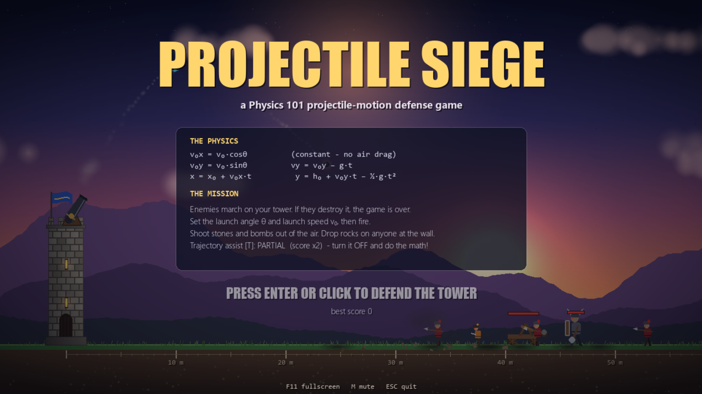
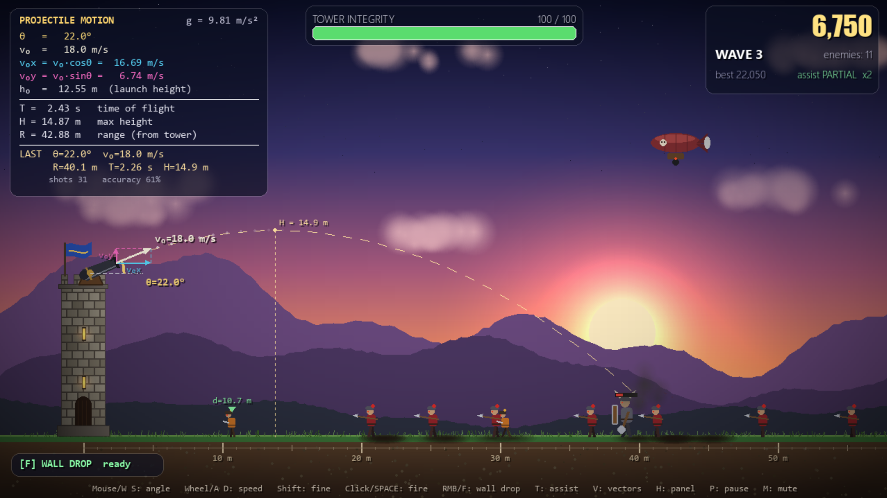
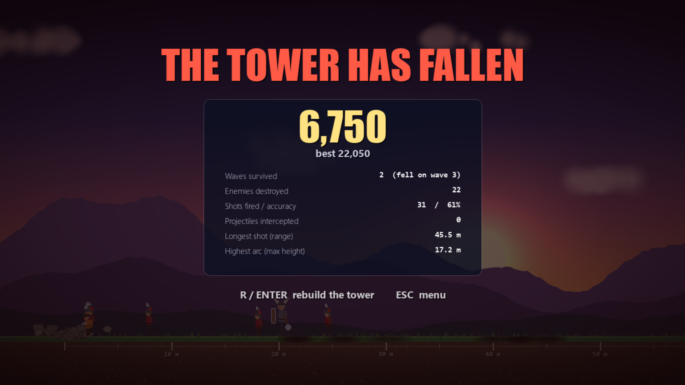

# Projectile Siege

A Pygame tower-defense game built on **projectile motion** and **free fall**.
Enemies march on your tower. You set the cannon's launch angle θ and launch speed v₀,
and every shell, stone and bomb flies according to the kinematic equations below.

## Gameplay

<p align="center">
  
  
  
</p>

## How to run

```
pip install pygame
python main.py
```

## Controls

| Key / Mouse | Action |
|---|---|
| Mouse, W / S | aim (launch angle θ) |
| Wheel, A / D | launch speed v₀ (hold Shift for fine steps) |
| Left click, Space | fire the cannon |
| Right click, F | Wall Drop (free-fall stone) |
| T | trajectory assist: FULL / PARTIAL / OFF (higher score multiplier) |
| V / H | show or hide the velocity vectors / physics panel |
| P, Esc | pause |
| M, F11 | mute, fullscreen |

## The physics

Model assumptions: no air resistance, constant g = 9.81 m/s² downward, flat ground at y = 0, 1 m = 20 px.

### Free fall (Wall Drop, airship bombs)

| Quantity | Equation |
|---|---|
| acceleration | a = −g |
| velocity | v_y = −g·t |
| height | y = h − ½·g·t² |
| fall time | t = √(2h / g) |
| impact speed | v = g·t = √(2gh) |

When an airship releases a bomb, the bomb keeps the airship's horizontal speed while it falls,
so the airship releases it early: `x_airship − speed·√(2Δh/g) = x_tower`.

### Projectile motion (cannon shells, catapult stones)

| Quantity | Equation |
|---|---|
| velocity components | v₀x = v₀·cosθ, v₀y = v₀·sinθ |
| position | x = x₀ + v₀x·t, y = h₀ + v₀y·t − ½·g·t² |
| velocity | v_x = v₀x (constant), v_y = v₀y − g·t |
| time to apex | t_top = v₀y / g |
| maximum height | H = h₀ + v₀y² / (2g) |
| time of flight | T = (v₀y + √(v₀y² + 2·g·h₀)) / g |
| range | R = x₀ + v₀x·T |
| trajectory | y = h₀ + Δx·tanθ − g·Δx² / (2·v₀²·cos²θ) |

The enemy catapults and the menu's demo cannon aim themselves by solving the trajectory
equation for the launch speed: `v₀ = √( g·Δx² / (2·cos²θ·(Δx·tanθ − Δy)) )`.

### Where it is in the code

All physics calculations are in **[physics.py](physics.py)**, one commented function per formula:

| Formula | Function in `physics.py` | Used in `main.py` by |
|---|---|---|
| t = √(2h/g) | `free_fall_time` | `Game.drop_stone`, airship bomb release in `Game.update_enemies` |
| v = √(2gh) | `free_fall_speed` | (reference) |
| v₀x = v₀·cosθ, v₀y = v₀·sinθ | `velocity_components` | `Shell`, `Game.predict`, `Game.catapult_fire` |
| v₀ = √(vx² + vy²), θ = tan⁻¹(vy/vx) | `speed_and_angle` | `Missile` |
| x = x₀ + v₀x·t, y = h₀ + v₀y·t − ½gt² | `position` | `Shell.pos`, `Game.draw_preview` |
| vy = v₀y − g·t | `vertical_velocity` | `Shell.vy` |
| t_top = v₀y / g | `time_to_apex` | `Game.record_shot`, `Game.draw_preview` |
| H = h₀ + v₀y² / (2g) | `max_height` | `Game.predict` |
| T = (v₀y + √(v₀y² + 2gh₀)) / g | `time_of_flight` | `Shell.ground_time`, `Game.predict` |
| R = x₀ + v₀x·T | `horizontal_range` | `Game.predict` |
| v₀ from the trajectory equation | `launch_speed_to_hit` | `Game.catapult_fire`, `Game.update_demo` |

Projectile positions are computed from the exact equations x(t), y(t) every frame, not
approximated step by step, so a shell lands exactly where the prediction says it will.
